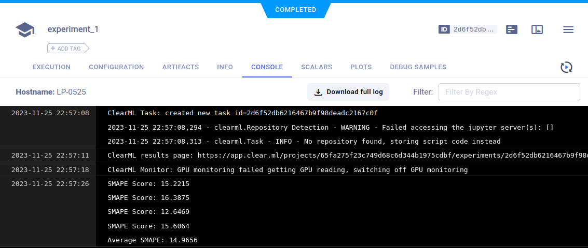
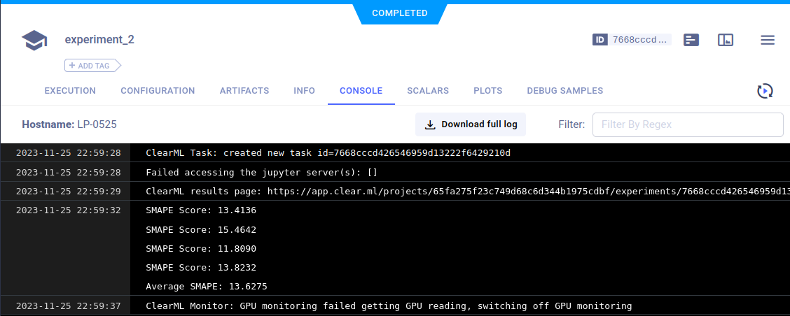
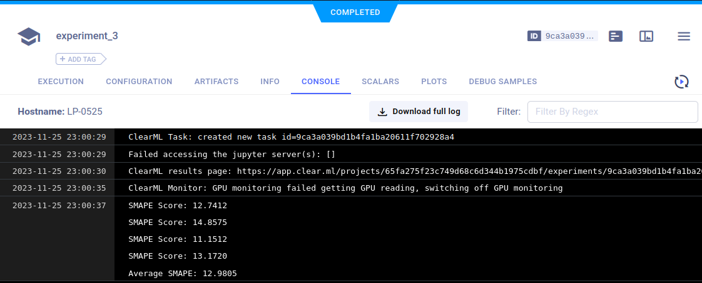

# mlops_2023_task2

## Этапы обучения модели

### 1. Feature Engineering

Были проведены три эксперимента, в каждом из которых признаки исходных данных изменялись для улучшения предсказательной модели:

- **Эксперимент 1**: Основные признаки с информацией о дне недели и one-hot кодированием для категориальных переменных (SMAPE 14.9656). 
  

- **Эксперимент 2**: Добавление сезонных признаков с использованием Фурье-преобразований, что улучшило точность модели (SMAPE 13.6275).
  

- **Эксперимент 3**: Уточнение признаков дня недели (будни/пятница/выходные) и добавление Фурье-преобразований, что дало наилучшее качество (SMAPE 12.9805).
  

### 2. Предварительная Обработка Признаков

Прежде чем обучать модель, признаки были стандартизированы:

- **Стандартизация**: Использование `StandardScaler` для стандартизации значений признаков.

### 3. Обучение Модели

Этапы обучения модели:

- **Кросс-валидация с GroupKFold**: Разделение данных на несколько частей для кросс-валидации с сохранением временной структуры.
- **Ridge-регрессия**: Применение L2-линейной регрессии для каждой части.
- **Усреднение Моделей**: Вместо использования одной модели усреднялись предсказания моделей, обученных на каждой части, для повышения обобщающей способности.
